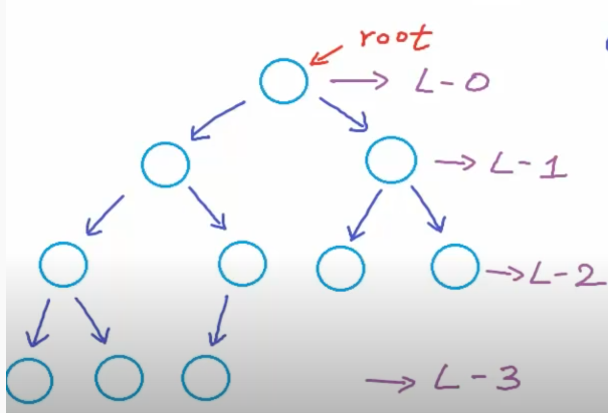
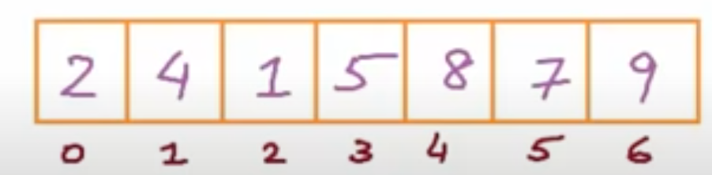
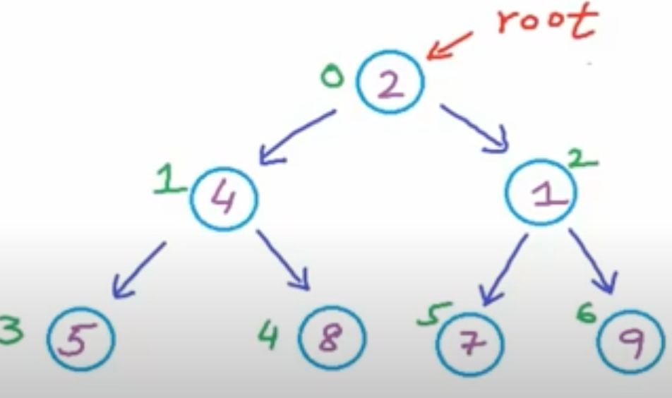

# Tree
Unlike Arrays, Linked Lists, Stack and queues, which are linear data structures, trees are hierarchical data structures.

## Application
1. Store naturally hierarchical data, e.g. file system
2. Organize data for quick search, insertion, deletion, e.g. BST
3. Trie for string, e.g. dictionary, word match, autocomplete.
4. Network routing algorithm

## Definition of Tree:
Tree is a subset of graph. A graph *G* is a tree iff the following two conditions are met:
>1. G is fully connected. For every pair of nodes in G, there is a path between them
>2. G has no cycle. IOW, there is one unique path between every pair of nodes in G

## Concepts
1. root, children, parent, leaf, grandparent, sibling, uncle, ancestor, subtree, etc.
2. Depth: length of path from root to x or number of edges in the path.
   1. root's depth is 0. Empty tree is -1
3. Height: Number of edges in longest path from x to a leaf
   1. Height of tree = height of root

## Different Types of Tree
### Binary Tree
> All nodes have at most two children.
1. Strict/Proper binary tree: each node has either 2 or 0 children.
2. Complete binary tree: all levels except the last are completely filled and all nodes are as left as possible on the last level.
3. Perfect binary tree: all levels are completely filled.
4. Balanced binary tree: difference between height of left and right subtree for every node is no more than $k$ (mostly 1).

#### Implementations
1. Dynamically created nodes with pointer between them.
2. Arrays.

#### Features


##### Node number in binary tree
Max number of nodes at level i = $2^i$.

Max number of nodes in a tree with height $h$, 
>$n = 2^0 + 2^1 + ... + 2^{h} = 2 ^{h+1} - 1 = 2^{no. of levels} - 1$

>$2^{h + 1} = n + 1 \Rightarrow h = log_{2}(n+1) - 1$

Height of a perfect binary tree with n nodes is $log_{2}(n+1) - 1$.

Height of a complete binary tree with n nodes is $\lfloor log_{2}n\rfloor$.

For a tree with n nodes, $\lfloor log_{2}n\rfloor <= h <= n - 1$,  minimum for a complete tree and maximum for a linear tree.

>The height of a tree is related to time complexity of operations on the tree. In most cases we would try to keep the tree balanced. 

#### Array representation



In a 0-indexed array representation of the tree,  

> for node at index i, left-child-index = $2i + 1$, right-child-index = $2i+2$, parent-indes = $(i - 1)//2$

### Traversal
>Process or visit each node in the tree exactly once.

Breath-First-Search using a queue is trivial. We mainly focus on Depth-First-Search(DFS)
1. Pre-order: **[root]**->[left]->[right]
2. In-order: [left]->**[root]**->[right]
3. Post-order: [left]->[right]->**[root]**

The order of left and right can be swapped, by convention left is visited first. The order is determined by when **root** is visited. 

```python
"""
Traversal using recursion is trivial. The following is iterative code.
"""
def preOrder(root):
   st = [root]
   while st:
      node = st.pop()
      #process root
      if not node:
         continue
      print(node.val)
      # add right, left child to stack
      st.append(node.right)
      st.append(node.left)

#Another pre-order approach
def preOrder(root):
   st = []
   while root or st:
      if not root:
         root = st.pop()
      print(root.val)
      if root.right: st.append(root.right)
      root = root.left

def inOrder(root):
   if not root:
      return
   st = []
   while root or st:
      # store all left child
      while root:
         st.append(root)
         root = root.left
      # top of stack is the left most, pop to avoid double-processing
      node = st.pop()
      print(node.val)
      #node has no left, so we go right
      root = node.right

# one trick: visit root -> right -> left and then reverse the result
def postOrder(root):
   st = []
   while st or root:
      while root:
         st.append(root)
         root = root.left or root.right
      # top of st has no left or right, we can process it
      node = st.pop()
      print(node.val)
      # process right if exist, otherwise the parent (top of stack) is next since both of its children are already processed
      if st and st[-1].left == node:
         root = stack[-1].right
```

### Binary Search Tree (BST)
The feature of BST can allow us to reduce searching space while searching for a value in the tree.  
#### Problems
* [285. Inorder Successor in BST](https://leetcode.com/problems/inorder-successor-in-bst/)
  * Get rid of left or right based on the comparison of root.val vs. p.val
  * The successor will always be the last one that is bigger than p

